<div align="center">

# EE Homework Solver

[](https://modal.com)
[](https://vllm.ai)
[](https://python.org)
[](https://streamlit.io)
[](https://pytorch.org)
[](https://huggingface.co)

</div>

An AI-powered electrical engineering homework solver that analyzes textbook PDFs, understands questions with images, and generates detailed step-by-step solutions with circuit diagrams using schemdraw.

## 🎥 Demo

https://github.com/user-attachments/assets/f4468396-6909-4174-b8ea-08ed2c2136d9

## 🚀 Features

- **📚 PDF Analysis**: Extract relevant pages from textbooks using ColPali vision-retrieval model
- **🔍 Multi-modal Question Analysis**: Process text questions and circuit images using Qwen2.5-VL
- **⚡ Circuit Diagram Generation**: Create schemdraw circuit diagrams using DeepSeek code generation
- **🌐 Streamlit Web Interface**: Tabbed interface with solution, generated code, and metadata
- **🔄 Cloud Processing**: All AI models run on Modal cloud infrastructure with vLLM for fast inference
- **⏱️ Performance Optimized**: Warm containers, parallel processing, and comprehensive logging

## 🏗️ Architecture

The system uses Modal cloud functions with three AI models served via vLLM for fast inference:

1. **ColPali** (GPU: T4) - PDF page retrieval and ranking
2. **Qwen2.5-VL** (GPU: A10, vLLM) - Vision-language understanding and solution generation  
3. **DeepSeek-Coder** (GPU: A10, vLLM) - Python code generation for schemdraw circuits

### System Flow

```mermaid
flowchart TD
    A["🌐 Streamlit Frontend<br/>User uploads PDF + images + question"] --> B["📡 Modal Function<br/>solve_ee_problem()"]
    
    B --> C["🖼️ Image Processing<br/>bytes to base64 for Qwen"]
    
    %% Parallel Processing Block
    C --> D["⚡ Parallel Execution"]
    D --> E["📚 ColPali Model<br/>GPU: T4"]
    D --> F["🚀 vLLM Servers Setup"]
    
    E --> G["📄 PDF Processing<br/>index_pdf_from_bytes()"]
    G --> H["🔍 Page Retrieval<br/>get_top_k_pages(k=3)"]
    
    F --> I["🧠 Qwen Server<br/>serve_qwen() - A10"]
    F --> J["💻 DeepSeek Server<br/>serve_deepseek() - A10"]
    
    %% Sequential Processing
    H --> K["📖 Qwen Analysis<br/>analyze_question_with_qwen_url()"]
    I --> K
    C --> K
    K --> L["📝 Text Solution Generated<br/>Step-by-step explanation"]
    
    L --> M["🔧 DeepSeek Code Gen<br/>generate_circuit_code()"]
    J --> M
    M --> N["🐍 Python Code<br/>schemdraw circuit code"]
    
    N --> O["⚙️ Circuit Generator<br/>run_generated_code()"]
    O --> P["🖼️ PNG Circuit Diagram<br/>Base64 encoded"]
    
    P --> Q["📊 Final Response<br/>{textual_solution, circuit_diagram, metadata}"]
    Q --> R["🌐 Streamlit Display<br/>Tabbed interface with LaTeX rendering"]
    
    %% Styling
    classDef frontend fill:#e1f5fe
    classDef modal fill:#f3e5f5
    classDef ai fill:#fff3e0
    classDef processing fill:#e8f5e8
    classDef output fill:#fce4ec
    
    class A,R frontend
    class B,C,D modal
    class E,I,J,K,M ai
    class G,H,O processing
    class L,N,P,Q output
```



## 📁 Project Structure

```
ee-tutor-system/
├── config/
│   ├── settings.py              # Model configurations and constants
│   ├── modal_config.py          # Modal cloud setup and shared image
│   ├── deepseek_prompt.txt      # DeepSeek prompt template with 6 examples
│   └── qwen_instructions.txt    # Qwen system instructions for EE tutoring
├── src/
│   ├── models/
│   │   ├── colpali_model.py     # ColPali PDF retrieval with T4 GPU
│   │   ├── qwen_model.py        # Qwen2.5-VL analysis with A10 GPU + vLLM
│   │   └── deepseek_model.py    # DeepSeek code generation with A10 GPU + vLLM
│   └── services/
│       └── circuit_generator.py # Safe schemdraw code execution
├── frontend/
│   └── streamlit_app.py         # Web interface with tabbed results
├── modal_app.py                 # Main orchestrator function
├── demo_img.png                 # Demo circuit diagram
├── requirements.txt             # Python dependencies
└── README.md                    # This file
```

## 🛠️ Setup

### Installation

1. **Clone repository**:
   ```bash
   git clone https://github.com/neha-nambiar/ee-homework-solver
   cd ee-tutor-system
   ```

2. **Install dependencies**:
   ```bash
   pip install -r requirements.txt
   ```

3. **Setup Modal**:
   ```bash
   modal token new
   ```

4. **Deploy to Modal**:
   ```bash
   modal deploy modal_app.py
   ```

## 🚀 Usage

### Web Interface

1. **Start Streamlit app**:
   ```bash
   streamlit run frontend/streamlit_app.py
   ```

2. **Use the interface**:
   - Upload a textbook PDF (required)
   - Optionally upload question images
   - Enter your electrical engineering question
   - Click "Generate Solution"
   - View results in three tabs:
     - **Solution**: LaTeX-formatted solution + circuit diagram
     - **Generated Code**: Python schemdraw code
     - **Metadata**: Processing details

## 🔧 Technical Implementation

### Performance Optimizations
- **Warm Containers**: `min_containers=1` keeps models loaded
- **Parallel Processing**: PDF indexing runs parallel to server startup
- **Persistent Volumes**: Cache models between deployments

### Model Configuration
- **ColPali**: `vidore/colpali-v1.3` on T4 GPU for PDF retrieval
- **Qwen2.5-VL**: `Qwen/Qwen2.5-VL-3B-Instruct` on A10 GPU for multimodal analysis
- **DeepSeek**: `deepseek-ai/deepseek-coder-1.3b-instruct` on A10 GPU for code generation

### Error Handling
- Comprehensive logging with step-by-step timing
- Health checks for vLLM servers with retry logic
- Safe code execution environment for schemdraw
- Graceful fallbacks for JSON parsing and code extraction

## 📊 Processing Flow

1. **Image Processing**: Convert user uploads to base64 for multimodal input
2. **PDF Indexing**: ColPali converts PDF pages to embeddings
3. **Page Retrieval**: Find top-3 relevant pages using semantic similarity
4. **Solution Generation**: Qwen2.5-VL analyzes question + images + PDF context
5. **Code Generation**: DeepSeek generates schemdraw code using few-shot examples
6. **Circuit Rendering**: Execute Python code safely to generate PNG diagram
7. **Response Assembly**: Combine text solution, circuit image, and metadata

## 🔧 Dependencies

### Core Infrastructure
- `modal` - Serverless cloud compute platform
- `vllm==0.9.1` - High-performance LLM inference server
- `streamlit` - Interactive web application framework

### AI/ML Models
- `colpali_engine` - Vision-based PDF retrieval
- `transformers` - Hugging Face model loading
- `qwen_vl_utils` - Qwen vision-language utilities
- `torch` - PyTorch deep learning framework

### Utilities
- `schemdraw` - Circuit diagram generation
- `matplotlib` - Plot rendering backend
- `pdf2image` - PDF to image conversion
- `Pillow` - Image processing
- `httpx` - HTTP client for API calls
